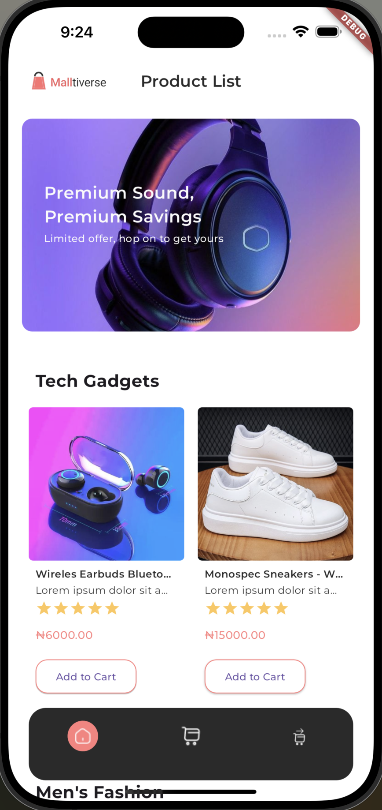
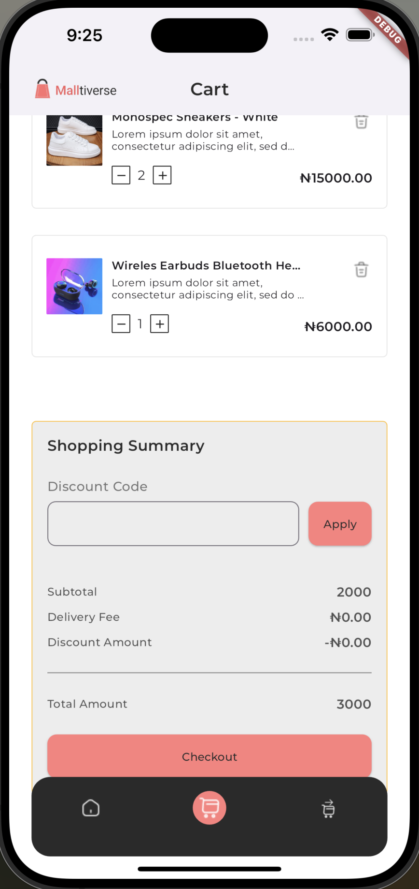
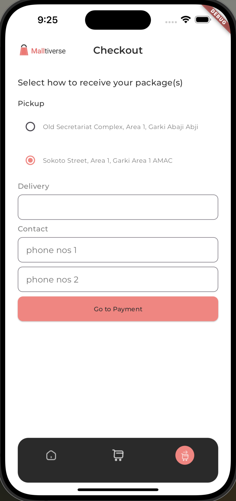
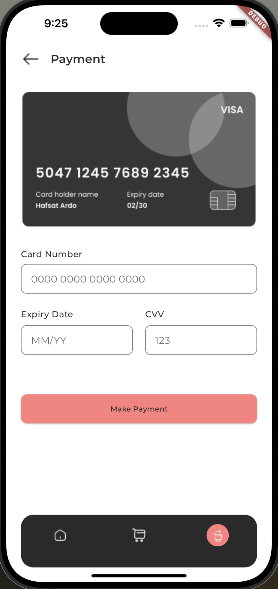
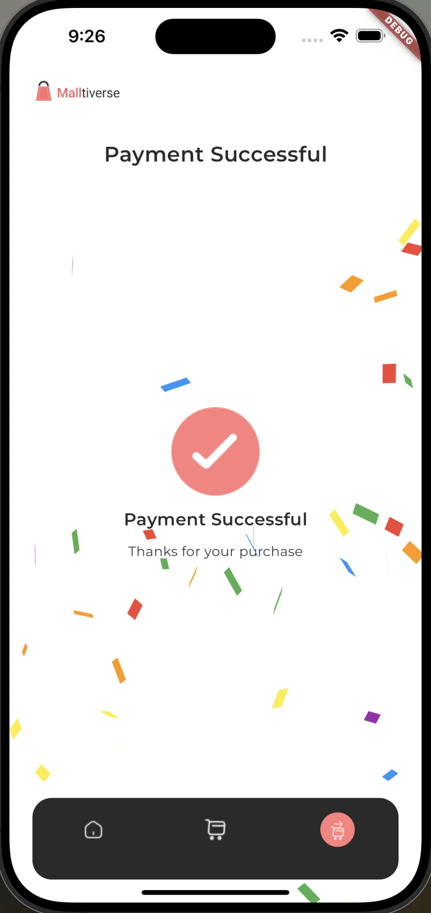

# HNG Shopping App

HNG Shopping App is a Flutter application that allows users to browse and purchase various products from different categories. This app integrates with a backend API to fetch product data and provide a seamless shopping experience.

## Features

- **Product Categories:** Browse products categorized into Tech Gadgets, Men's Fashion, and Women's Fashion.
- **Product Listing:** View detailed product listings including images, descriptions, ratings, and prices.
- **Shopping Cart:** Add products to the cart and proceed to checkout.
- **Checkout Process:** Complete the purchase securely with integrated payment methods.

## Screenshots







## Technologies Used

- **Flutter:** For building cross-platform mobile apps.
- **Provider:** For state management within the app.
- **HTTP Package:** For making API calls to fetch product data.
- **Google Fonts:** For custom typography across the app.

## Installation

To run this application locally, follow these steps:

1. Clone this repository:

```bash
git clone https://github.com/your/repository.git
```

2. Navigate into the project directory:

```bash
cd hng_shopping_app
```

3. Install dependencies:

```bash
flutter pub get
```

4. Run the app:

```bash
flutter run
```

## API Integration

This app integrates with [timbu API](https://app.timbu.cloud) to fetch product data. Ensure that the API endpoints are correctly configured in `lib/services/api_service.dart`.

## Contributing

Contributions are welcome! Here's how you can contribute to this project:

1. Fork the repository
2. Create your feature branch (`git checkout -b feature/AmazingFeature`)
3. Commit your changes (`git commit -m 'Add some AmazingFeature'`)
4. Push to the branch (`git push origin feature/AmazingFeature`)
5. Open a pull request

## License

This project is licensed under the MIT License - see the [LICENSE](LICENSE) file for details.

## Acknowledgments

- **Flutter Community:** For providing amazing packages and resources.
- **HNG Internship:** For inspiring this project and providing learning opportunities.

## Contact

For any questions or suggestions, feel free to reach out at [ezeanyimhenry@gmail.com](mailto:ezeanyimhenry@gmail.com).
